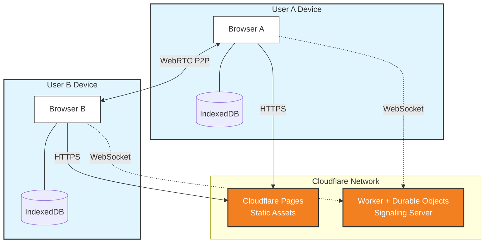

# RetroBoard 🎯

**Live Demo: [https://retro-board.pages.dev](https://retro-board.pages.dev)**

A **local-first, real-time collaborative retrospective board** that works entirely in the browser. No servers, no signups - just share a link and start collaborating.


  

## Features

- **Google Docs-Style Editing** - Multiple users can edit the same card simultaneously with character-by-character real-time syncing
- **Real-time P2P Sync** - Changes sync instantly between browsers via WebRTC
- **Offline Persistence** - Cards saved to IndexedDB, survive page refresh
- **Interactive TUI** - Connect to your board from the terminal with a retro-styled interface
- **Image Support** - Paste images directly into cards
- **No Backend** - Everything runs in the browser or terminal

## Terminal Interface (TUI)

RetroBoard now includes a full terminal interface that syncs in real-time with browser users.

### Quick Install (macOS/Linux)
```bash
curl -fsSL https://mikelockz.github.io/retro/install.sh | bash
```

### Usage
```bash
# Join a room
retro-tui my-retro-room
```

### TUI Keyboard Shortcuts
- `↑ / ↓` - Navigate through cards
- `a` - Add a new card (Input mode)
- `v` - Vote on the selected card
- `r` - Force reconnect
- `Esc` - Exit

## How It Works



1. Open the app - a unique room URL is generated
2. Share the URL with your team
3. Everyone's changes sync automatically via peer-to-peer WebRTC
4. Data persists locally even when all users disconnect

## Collaborative Editing

RetroBoard uses [Yjs CRDTs](https://yjs.dev/) with `Y.Text` for Google Docs-style collaborative editing:

- **Real-time Character Sync** - Every keystroke syncs instantly to all connected users
- **Conflict-Free Merging** - Multiple users can type in the same card simultaneously without conflicts
- **Cursor Preservation** - Your cursor stays in place even when others are editing
- **Draft State** - New cards start in "Draft" mode and commit when you press Enter or click away
- **Auto-Cleanup** - Empty uncommitted cards are automatically removed after 5 minutes of inactivity

**Try it:** Open two browser tabs to the same room, create a card, and start typing in both tabs at the same time!

## Development

```bash
# Install dependencies
npm install

# Start browser dev server
npm run dev

# Start TUI locally
npm run tui my-room-name

# Build browser for production
npm run build

# Build TUI binary
npm run build:tui-binary
```

## Self-Hosting Signaling Server

The project uses a custom Cloudflare Worker for WebRTC signaling instead of the public Yjs signaling servers.

1. Navigate to the worker directory:
   ```bash
   cd infra/worker
   ```

2. Install dependencies:
   ```bash
   npm install
   ```

3. Deploy to Cloudflare:
   ```bash
   npx wrangler deploy
   ```

4. Configure the client to use your worker:
   - Create a `.env` file in the project root
   - Add your worker URL:
     ```
     VITE_SIGNALING_URL=wss://your-worker-name.your-subdomain.workers.dev
     ```

## License

MIT
