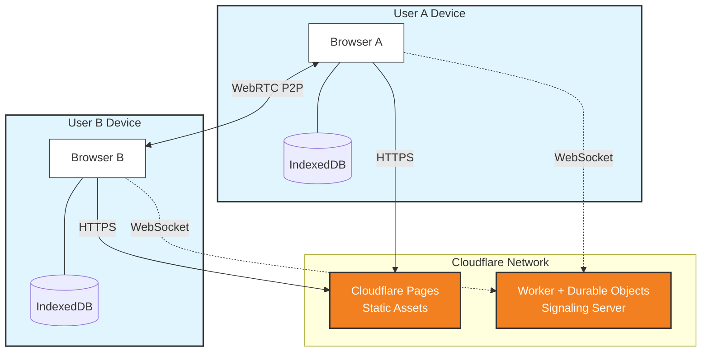

# RetroBoard 🎯

A **local-first, real-time collaborative retrospective board** that works entirely in the browser. No servers, no signups - just share a link and start collaborating.


  

## Features

- **🔄 Real-time P2P Sync** - Changes sync instantly between browsers via WebRTC
- **💾 Offline Persistence** - Cards saved to IndexedDB, survive page refresh
- **👤 Anonymous Presence** - See collaborators as "Anonymous Fox", "Anonymous Panda", etc.
- **👍 Voting** - Upvote cards with per-user tracking
- **🎨 Modern UI** - Glassmorphism design with dark gradient theme
- **🚫 No Backend** - Everything runs in the browser

## How It Works



1. Open the app - a unique room URL is generated
2. Share the URL with your team
3. Everyone's changes sync automatically via peer-to-peer WebRTC
4. Data persists locally even when all users disconnect

## Tech Stack

| Technology | Purpose |
|------------|---------|
| [Yjs](https://yjs.dev/) | CRDT engine for conflict-free merging |
| [y-webrtc](https://github.com/yjs/y-webrtc) | P2P sync via WebRTC |
| [y-indexeddb](https://github.com/yjs/y-indexeddb) | Browser persistence |
| [Cloudflare Workers](https://workers.cloudflare.com/) | Serverless signaling infrastructure |
| [Durable Objects](https://developers.cloudflare.com/durable-objects/) | State management for signaling rooms |
| React + Vite | UI framework |
| Tailwind CSS | Styling |

## Development

```bash
# Install dependencies
npm install

# Start dev server
npm run dev

# Build for production
npm run build
```

## Self-Hosting Signaling Server

The project uses a custom Cloudflare Worker for WebRTC signaling instead of the public Yjs signaling servers.

1. Navigate to the worker directory:
   ```bash
   cd infra/worker
   ```

2. Install dependencies:
   ```bash
   npm install
   ```

3. Deploy to Cloudflare:
   ```bash
   npx wrangler deploy
   ```

4. Configure the client to use your worker:
   - Create a `.env` file in the project root
   - Add your worker URL:
     ```
     VITE_SIGNALING_URL=wss://your-worker-name.your-subdomain.workers.dev
     ```

## License

MIT
